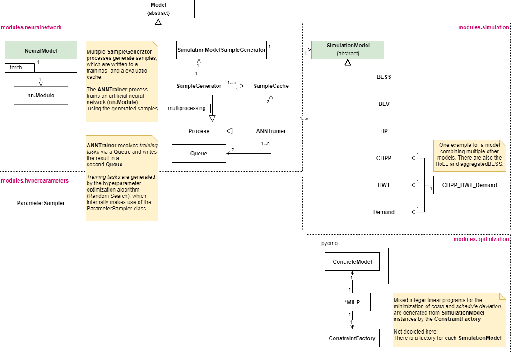

# Artificial-Neural-Network-based Surrogate Models

This repository provides supplementary material for the Doctoral thesis "Modeling and Communicating Flexibility in Smart Grids Using Artificial Neural Networks as Surrogate Models" (to be published).

## Motivation briefly explained

The transition towards renewable energies makes balancing electricity demand and supply increasingly challenging and requires us to make use of the flexibility of the former demand side. 
In this context, it would be nice if we could automatically generate models of the available flexibility instead of handcrafting models for many different sites, e.g., buildings, factories, or smart districts.
How this could be done and how well artificial neural networks (ANNs) perform as surrogate models is investigated in the thesis.

## Prerequisites

Several packages have to be installed in order to use the provided scripts.
The conda environment that has been used in the thesis is specified in [environment.yml](environment.yml).

## Materials

### Overview

The contents of the repository are structured as follows:

|Folder|Contents|
|---|---|
| [data/](#data) | Input data for the different experiments|
| [evaluation/](#evaluation) | trained ANNs, generated results, and scripts for each experiment |
| [learning/](#learning) | script for training ANNs and many different configuration files |
| [modules/](#modules) | code base, including all simulation and optimization models |

### data/

- crest_*: (Average) el. and thermal consumption of 60 buildings in kW, for a day in summer, winter, and intermediate season.

    Generated with CREST
    - week day
    - 49°N 8,4°E
    - 4 residents, detached building, regular boiler

- eshl_data: 273 days of real KIT Energy Smart Home Lab data, split into 3 files:
    - initial temperature of HWT
    - month of time series
    - load profile in W

- gc_bess_*: Real data from two identical BESSs
  
- holl_heat_demand: Real FZI House of Living Labs data

### evaluation/

#### Models

Please note that the evaluated surrogate modeling approach makes use of two ANNs, a 'state model' and an 'action model'.
The different ANNs can be found in 'evaluation/schedule_generation/results'.
For each ANN the following data is provided

| File | Description |
|--|--|
|_log.txt|Log file of the training process|
|_loss_statistics_evaluation.npy|Losses from the training process evaluated with data from the evaluation cache (see [modules/](#modules/))|
|_loss_statistics_training.npy|Losses from the training process evaluated with data from the training cache (see [modules/](#modules/))|
|_meta.pt|Simulation model instance and data pre- and post-processing configuration|
|_nn.pt|The actual ANN|
|_parameters.pt|Hyperparameters|
|_summary.txt| _meta.pt, _parameters.pt and _nn.pt in a human readable format|
|log.txt|Log file of the overall training process (including ANNs that performed worse)|
|search_log.npy|Contains the result achieved for each attempt of training an ANN|

#### Experiments (subfolders)

- classification/

    Classification results generated with the ANNs found in the "schedule_generation" folder.
    In order to repeat the classification evaluation:

    1. open [statebased.py](evaluation/classification/statebased.py)
    2. point 'state_model_location' and 'state_model_location' towards the ANN folders
    3. run the script

    The associated simulation model is automatically loaded from the stored ANN

- optimization_target/

    In this experiment 10 identical distributed energy resources (DERs) are represented by 10 identical surrogate models. The goal is to find schedules for each DER that add up to a given (reachable) target schedule.

    Scripts:
    - [mcts_adapted_statebased.py](evaluation/optimization_target/mcts_adapted_statebased.py): the actual experiment, creates target schedules and tries to reach them
    - [evaluation.py](evaluation/optimization_target/evaluation.py): performs the evaluation
    - [analysis.py](evaluation/optimization_target/analysis.py) (optional): script to perform some additional analysis of erroneous predictions

    Before running the experiment, make sure everything is configured correctly. 
    Each DER configuration has to be selected manually.

- real_schedule_classification/

    There have been two experiments using real data. For each a script is provided. Simply run the script to reproduce the results.

- schedule_generation/

    In order to run this experiment:
    
    1. open [statebased.py](evaluation/schedule_generation/statebased.py)
    2. point 'state_model_location' and 'state_model_location' towards the ANN folders
    3. adapt 'choose_action' to either choose actions with the 'reference strategy' or 'random strategy'
    4. run the script

You can find many more parameters in the scripts, for instance a feasibility threshold. These have not been changed between experiments. Nevertheless, feel free to do so.

### learning/

In the subfolder 'state-based' you find the different configuration files for training the ANNs.
There is one configuration file for each ANN.
Since for each 'DER configuration' two ANNs are needed, it is two configuration files per 'DER configuration'.
In order to make a training run:

1. create or select a configuration file
2. update train.py to load this configuration file
3. run train.py

The configuration files include a list of possible hyperparameter values from which the training algorithm samples.
In an early development stage, some preliminary tests with an evolutionary algorithm have been conducted, but the algorithm was replaced with a random search, due to resource demand.
The code of the evolutionary algorithm is included in the repository, but has not been tested or adapted since.

### modules/

The 'modules' folder contains the complete software framework that has been developed in the context of the thesis. Below you can find an overview of this framework in the form of a class diagram:

